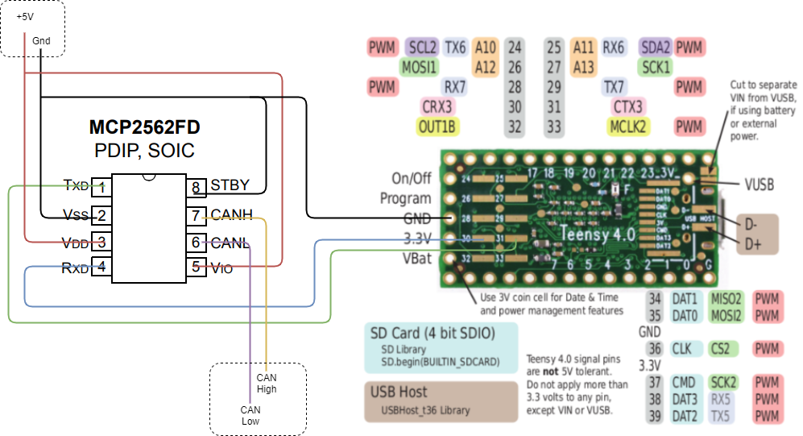

# Can4Python
Python API for an Open Source USB to CAN-BUS Interface. Can4Python offers a bunch of functionalities in order to send and receive CAN-Messages.
This implementation uses a [Teensy4.0 Board](https://www.pjrc.com/store/teensy40.html), connected to a [MCP2562FD CAN FD transreceiver](https://www.microchip.com/wwwproducts/en/MCP2562FD) at CAN3 on the hardware side, as well as the [FlexCAN_T4](https://github.com/tonton81/FlexCAN_T4) library on the software side.
In theory also other Controllers could be used with little changes in the main *.ino file, if they are Arduino compatible and offer a CAN-Bus interface. 

## Prerequisites
* Visual Studio 2017 or later with the workloads mentioned in this [article](https://docs.microsoft.com/en-us/visualstudio/python/working-with-c-cpp-python-in-visual-studio?view=vs-2019#create-the-python-application) 
* [Boost 1.65.0](https://www.boost.org/users/history/version_1_65_0.html) and environment variables BOOST_ROOT and BOOST_LIBRARYDIR set
* Visual C++ 2015.3 v140 toolset installed (via Visual Studio installer → Modify / Individual Components)

## Example Wiring

Image sources: [PJRC](https://www.pjrc.com/teensy/pinout.html) and [Microchip](http://ww1.microchip.com/downloads/en/DeviceDoc/20005284A.pdf)

## Prepare Hardware
Can4Python uses the Teensy RawHID interface for the USB Communication. In order to send USB packets with a size of 255 Bytes modify the file *%ARDUINO_IDE_INSTALLDIR%\hardware\teensy\avr\cores\teensy4\usb_desc.h* accordingly:
```
...
#elif defined(USB_RAWHID)
  #define VENDOR_ID		0x16C0
  #define PRODUCT_ID		0x0486
  #define RAWHID_USAGE_PAGE	0xFFAB  // recommended: 0xFF00 to 0xFFFF
  #define RAWHID_USAGE		0x0200  // recommended: 0x0100 to 0xFFFF
  #define MANUFACTURER_NAME	{'T','e','e','n','s','y','d','u','i','n','o'}
  #define MANUFACTURER_NAME_LEN	11
  #define PRODUCT_NAME		{'T','e','e','n','s','y','d','u','i','n','o',' ','R','a','w','H','I','D'}
  #define PRODUCT_NAME_LEN	18
  #define EP0_SIZE		64 /* Original: 64 */
  #define NUM_ENDPOINTS         4
  #define NUM_USB_BUFFERS	30		/* Original: 12 */
  #define NUM_INTERFACE		2		/* Original: 2 */
  #define RAWHID_INTERFACE      0	// RawHID
  #define RAWHID_TX_ENDPOINT    3   /* Original: 3 */
  #define RAWHID_TX_SIZE        255  /* Original: 64*/
  #define RAWHID_TX_INTERVAL    1	// TODO: is this ok for 480 Mbit speed
  #define RAWHID_RX_ENDPOINT    4
  #define RAWHID_RX_SIZE        255  /* Original: 64*/
  #define RAWHID_RX_INTERVAL    1	// TODO: is this ok for 480 Mbit speed
  #define SEREMU_INTERFACE      1	// Serial emulation
  #define SEREMU_TX_ENDPOINT    2
  #define SEREMU_TX_SIZE        64
  #define SEREMU_TX_INTERVAL    1	 // TODO: is this ok for 480 Mbit speed
  #define SEREMU_RX_ENDPOINT    2
  #define SEREMU_RX_SIZE        32
  #define SEREMU_RX_INTERVAL    2	 // TODO: is this ok for 480 Mbit speed
  #define ENDPOINT2_CONFIG	ENDPOINT_RECEIVE_INTERRUPT + ENDPOINT_TRANSMIT_INTERRUPT
  #define ENDPOINT3_CONFIG	ENDPOINT_TRANSMIT_INTERRUPT /*ENDPOINT_RECEIVE_UNUSED + ENDPOINT_TRANSMIT_INTERRUPT*/
  #define ENDPOINT4_CONFIG	ENDPOINT_RECEIVE_INTERRUPT /*ENDPOINT_RECEIVE_INTERRUPT + ENDPOINT_TRANSMIT_UNUSED*/ 
...
```
1. Run the script *init-repo.sh*
2. Open the file *Teensy40.ino* with the Arduino Teensy IDE
3. Compile and Flash

## Install the Python package
In order to globally install the Can4Python package, navigate into the *CanInterface* Folder and run `python -m pip install .` in an elevated console.

## Example Script
```python
from Can4Python import CanInterface
import time
can = CanInterface()
can.OpenCan20(0, 500000, False)
can.AddReceiveHandler(0, can.IdentifierFlags.STANDARD_11BIT)
can.StartReceiving(0)
can.SendCanMessage(0, 0x7e0, [0x02, 0x3e, 0x00], 0)
time.sleep(0.5)
resp = can.GetCanMessage(0)
for b in resp['payload']: print(b)
can.CloseCan(0)
```

## CanInterface Documentation
**Provided functions:**
<table class="tg">
  <tr>
    <th class="tg-1wig">Function</th>
    <th class="tg-1wig">Parameters</th>
    <th class="tg-1wig">Return value</th>
    <th class="tg-0lax">Description</th>
  </tr>
  <tr>
    <td class="tg-0lax">CanInterface()</td>
    <td class="tg-0lax">-</td>
    <td class="tg-0lax">Class instance</td>
    <td class="tg-0lax">Constructor for CanInterface class</td>
  </tr>
  <tr>
    <td class="tg-0lax">GetDeviceCount()</td>
    <td class="tg-0lax">-</td>
    <td class="tg-0lax">(int) Number of connected Devices</td>
    <td class="tg-0lax">Get the number of connected USB to CAN Devices</td>
  </tr>
  <tr>
    <td class="tg-0lax">EnableTransreceiver(devIndex)</td>
    <td class="tg-0lax"><b>(int) devIndex:</b> Index of device</td>
    <td class="tg-0lax">(bool) Success</td>
    <td class="tg-0lax">Enables the CAN transreceiver</td>
  </tr>
  <tr>
    <td class="tg-0lax">DisableTransreceiver(devIndex)</td>
    <td class="tg-0lax"><b>(int) devIndex:</b> Index of device</td>
    <td class="tg-0lax">(bool) Success</td>
    <td class="tg-0lax">Disables the CAN transreceiver</td>
  </tr>
  <tr>
    <td class="tg-0lax">OpenCan20(devIndex, baudrate, listenOnly)</td>
    <td class="tg-0lax">
        <b>(int) devIndex:</b> Index of device<br/><br/>
        <b>(int) baudrate:</b> CAN Baudrate<br/><br/>
        <b>(bool) listenOnly:</b> Listen only mode
    </td>
    <td class="tg-0lax">(bool) Success</td>
    <td class="tg-0lax">Opens the CAN Device with CAN 2.0 settings</td>
  </tr>
  <tr>
    <td class="tg-0lax">OpenCanFD(devIndex, arbitrationBaudrate, dataBaudrate, listenOnly, samplePoint, propDelay, busLength)</td>
    <td class="tg-0lax">
        <b>(int) devIndex:</b> Index of device<br/><br/>
        <b>(int) arbitrationBaudrate:</b> Arbitration Baudrate<br/><br/>
        <b>(int) dataBaudrate:</b> Data Baudrate<br/><br/>
        <b>(bool) listenOnly:</b> Listen only mode<br/><br/>
        <b>(float) samplePoint:</b> Sample Point setting<br/><br/>
        <b>(float) propDelay:</b> Bus propagation delay<br/><br/>
        <b>(float) busLength:</b> Bus length
    </td>
    <td class="tg-0lax">(bool) Success</td>
    <td class="tg-0lax">Opens the CAN Device with CAN FD settings</td>
  </tr>
  <tr>
    <td class="tg-0lax">CloseCan(devIndex)</td>
    <td class="tg-0lax"><b>(int) devIndex:</b> Index of device</td>
    <td class="tg-0lax">(bool) Success</td>
    <td class="tg-0lax">Closes CAN communication</td>
  </tr>
  <tr>
    <td class="tg-0lax">StartReceiving(devIndex)</td>
    <td class="tg-0lax"><b>(int) devIndex:</b> Index of device</td>
    <td class="tg-0lax">-</td>
    <td class="tg-0lax">Start receiving CAN Messages with device</td>
  </tr>
  <tr>
    <td class="tg-0lax">StopReceiving(devIndex)</td>
    <td class="tg-0lax"><b>(int) devIndex:</b> Index of device</td>
    <td class="tg-0lax">-</td>
    <td class="tg-0lax">Stop receiving CAN Messages with device</td>
  </tr>
  <tr>
    <td class="tg-0lax">SendCanMessage(devIndex, messageId, payload, messageFlags)</td>
    <td class="tg-0lax">
        <b>(int) devIndex:</b> Index of device<br/><br/>
        <b>(int) messageId:</b> CAN arbitration Identifier<br/><br/>
        <b>(array) payload:</b> Payload<br/><br/>
        <b>(int) messageFlags:</b> Message flags for enabling Bitrate Switch, Extended Datalength or Extended Identifier
    </td>
    <td class="tg-0lax">(bool) Success</td>
    <td class="tg-0lax">Send CAN Messages with device</td>
  </tr>
  <tr>
    <td class="tg-0lax">SendCanMessageAsync(devIndex, messageId, payload, messageFlags)</td>
    <td class="tg-0lax">
        <b>(int) devIndex:</b> Index of device<br/><br/>
        <b>(int) messageId:</b> CAN arbitration Identifier<br/><br/>
        <b>(array) payload:</b> Payload<br/><br/>
        <b>(int) messageFlags:</b> Message flags for enabling Bitrate Switch, Extended Datalength or Extended Identifier
    </td>
    <td class="tg-0lax">(bool) Success</td>
    <td class="tg-0lax">Send CAN Messages with device asynchronly</td>
  </tr>
  <tr>
    <td class="tg-0lax">GetCanMessage(devIndex)</td>
    <td class="tg-0lax"><b>(int) devIndex:</b> Index of device</td>
    <td class="tg-0lax">(dict {"identifier": ..., "payload": ..., "messageFlags": ..., "timestamp": ...}) Received CAN Message or empty object</td>
    <td class="tg-0lax">Get one CAN Message from the receive Buffer</td>
  </tr>
  <tr>
    <td class="tg-0lax">AddReceiveHandler(devIndex, messageId, identifierFlags)</td>
    <td class="tg-0lax">
        <b>(int) devIndex:</b> Index of device<br/><br/>
        <b>(int) messageId:</b> CAN arbitration Identifier<br/><br/>
        <b>(int) identifierFlags:</b> Identifier flags
    </td>
    <td class="tg-0lax">(int) Handler ID</td>
    <td class="tg-0lax">Adds an receive handler on the device which takes CAN Messages with the given Identifier and Message Flags (e.g. only 11Bit)</td>
  </tr>
  <tr>
    <td class="tg-0lax">AddReceiveHandler(devIndex, lowerMessageId, higherMessageId,
		identifierFlags)</td>
    <td class="tg-0lax">
        <b>(int) devIndex:</b> Index of device<br/><br/>
        <b>(int) lowerMessageId:</b> Lower CAN arbitration Identifier<br/><br/>
        <b>(int) higherMessageId:</b> Higher CAN arbitration Identifier<br/><br/>
        <b>(int) identifierFlags:</b> Identifier flags
    </td>
    <td class="tg-0lax">(int) Handler ID</td>
    <td class="tg-0lax">Adds an receive handler on the device which takes CAN Messages with the given Identifier range and Message Flags (e.g. only 11Bit)</td>
  </tr>
  <tr>
    <td class="tg-0lax">AddReceiveHandler(devIndex, identifierFlags)</td>
    <td class="tg-0lax">
        <b>(int) devIndex:</b> Index of device<br/><br/>
        <b>(int) identifierFlags:</b> Identifier flags
    </td>
    <td class="tg-0lax">(int) Handler ID</td>
    <td class="tg-0lax">Adds an receive handler on the device which takes all CAN Message with the given Identifier Flags (e.g. only 11Bit)</td>
  </tr>
  <tr>
    <td class="tg-0lax">RemoveReceiveHandler(devIndex, handlerId = -1)</td>
    <td class="tg-0lax">
        <b>(int) devIndex:</b> Index of device<br/><br/>
        <b>(int, optional) handlerId:</b> Receive Handler ID
    </td>
    <td class="tg-0lax">(bool) Success</td>
    <td class="tg-0lax">Removes the receive handler specified with the ID or all if -1 is used as ID</td>
  </tr>
</table>

**IdentifierFlags values:**
- STANDARD_11BIT
- EXTENDED_29BIT

**MessageFlags values:**
- USE_EDL
- USE_BRS
- USE_EXT
